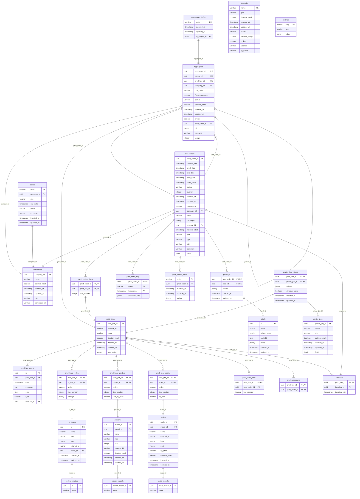

```mermaid
erDiagram
    aggregates ||--o{ aggregates : "parent_id"
    aggregates ||--|| prod_lines : "prod_line_id"
    aggregates ||--|| companies : "company_id"
    aggregates ||--|| prod_orders : "prod_order_id"
    aggregates_buffer ||--|| aggregates : "aggregate_id"
    
    codes ||--|| companies : "company_id"
    
    prod_lines ||--o{ prod_line_errors : "prod_line_id"
    prod_lines ||--o{ prod_lines_io_bus : "prod_line_id"
    prod_lines ||--o{ prod_lines_printers : "prod_line_id"
    prod_lines ||--o{ prod_lines_scales : "prod_line_id"
    prod_lines ||--o{ prod_order_next : "prod_line_id"
    prod_lines ||--o{ prod_processing : "prod_line_id"
    prod_lines ||--o{ iterations : "prod_line_id"
    
    prod_orders ||--o{ aggregates : "prod_order_id"
    prod_orders ||--|| companies : "company_id"
    prod_orders ||--o{ prod_orders_lines : "prod_order_id"
    prod_orders ||--o{ printings : "prod_order_id"
    prod_orders ||--o{ prod_order_log : "prod_order_id"
    prod_orders ||--o{ prod_orders_buffer : "prod_order_id"
    prod_orders ||--|| iterations : "iteration_id"
    
    prod_orders_lines ||--|| prod_lines : "prod_line_id"
    
    io_buses ||--|| io_bus_models : "model_id"
    prod_lines_io_bus ||--|| io_buses : "io_bus_id"
    
    printers ||--|| printer_models : "model_id"
    prod_lines_printers ||--|| printers : "printer_id"
    
    scales ||--|| scale_models : "model_id"
    prod_lines_scales ||--|| scales : "scale_id"
    
    printings ||--|| labels : "label_id"
    printer_job_values ||--|| printer_jobs : "printer_job_id"
    printer_job_values ||--|| prod_lines : "prod_line_id"
    
    aggregates {
        uuid aggregate_id PK
        uuid parent_id FK
        uuid prod_line_id FK
        uuid company_id FK
        varchar unit_code
        boolean from_aggregate
        varchar status
        boolean deletion_mark
        timestamp inserted_at
        timestamp updated_at
        boolean group
        uuid prod_order_id FK
        integer lvl
        varchar tg_name
        integer weight
    }
    
    aggregates_buffer {
        varchar code PK
        timestamp inserted_at
        timestamp updated_at
        uuid aggregate_id FK
    }
    
    codes {
        varchar code PK
        uuid company_id FK
        varchar gtin
        timestamp exp_date
        varchar status
        varchar tg_name
        timestamp inserted_at
        timestamp updated_at
    }
    
    companies {
        uuid company_id PK
        varchar name
        boolean deletion_mark
        timestamp inserted_at
        timestamp updated_at
        varchar gln
        varchar participant_id
    }
    
    io_bus_models {
        uuid id PK
        varchar name
    }
    
    io_buses {
        uuid id PK
        varchar name
        varchar host
        integer port
        varchar external_id
        uuid model_id FK
        timestamp inserted_at
        timestamp updated_at
    }
    
    iterations {
        uuid prod_line_id FK,PK
        uuid iteration_id PK
        timestamp iteration_start
    }
    
    labels {
        uuid id PK
        varchar name
        varchar printer_model
        text scaffold
        jsonb[] fields
        timestamp inserted_at
        timestamp updated_at
    }
    
    printer_job_values {
        uuid prod_line_id FK,PK
        uuid printer_job_id FK,PK
        jsonb values
        boolean deletion_mark
        timestamp inserted_at
        timestamp updated_at
    }
    
    printer_jobs {
        uuid printer_job_id PK
        varchar name
        varchar title
        boolean deletion_mark
        timestamp inserted_at
        timestamp updated_at
        jsonb fields
    }
    
    printer_models {
        uuid printer_model_id PK
        varchar name
    }
    
    printers {
        uuid printer_id PK
        uuid model_id FK
        varchar name
        varchar host
        integer port
        varchar external_id
        boolean deletion_mark
        timestamp inserted_at
        timestamp updated_at
    }
    
    printings {
        uuid prod_order_id FK,PK
        uuid label_id FK,PK
        jsonb[] values
        timestamp inserted_at
        timestamp updated_at
    }
    
    prod_line_errors {
        uuid id PK
        uuid prod_line_id FK
        timestamp date
        text message
        text error
        varchar type
        uuid iteration_id FK
    }
    
    prod_lines {
        uuid prod_line_id PK
        varchar external_id
        varchar name
        boolean deletion_mark
        timestamp inserted_at
        timestamp updated_at
        integer stop_delay
    }
    
    prod_lines_io_bus {
        uuid prod_line_id FK,PK
        uuid io_bus_id FK,PK
        boolean active
        integer line_number
        jsonb[] settings
    }
    
    prod_lines_printers {
        uuid prod_line_id FK,PK
        uuid printer_id FK,PK
        boolean active
        integer line_number
        boolean utils_by_print
    }
    
    prod_lines_scales {
        uuid prod_line_id FK,PK
        uuid scale_id FK,PK
        boolean active
        integer line_number
        boolean by_stab
    }
    
    prod_order_log {
        uuid prod_order_id FK,PK
        varchar event PK
        timestamp timestamp PK
        jsonb additional_info
    }
    
    prod_order_next {
        uuid prod_line_id FK,PK
        uuid prod_order_id FK
        integer line_number
    }
    
    prod_orders {
        uuid prod_order_id PK
        timestamp release_date
        timestamp prod_date
        timestamp exp_date
        timestamp start_date
        timestamp finish_date
        varchar status
        integer quantity
        timestamp inserted_at
        timestamp updated_at
        boolean typography
        uuid company_id FK
        varchar batch
        jsonb[] packages
        uuid iteration_id FK
        timestamp iteration_start
        varchar shift
        varchar type
        varchar gtin
        varchar comment
        jsonb label
    }
    
    prod_orders_buffer {
        varchar code PK
        uuid prod_order_id FK
        timestamp inserted_at
        timestamp updated_at
        integer weight
    }
    
    prod_orders_lines {
        uuid prod_order_id FK,PK
        uuid prod_line_id FK,PK
        integer line_number
    }
    
    prod_processing {
        uuid prod_line_id FK,PK
        uuid prod_order_id FK,PK
    }
    
    products {
        varchar name PK
        varchar gtin
        boolean deletion_mark
        timestamp inserted_at
        timestamp updated_at
        varchar brand
        boolean variable_weight
        boolean is_keg
        varchar volume
        varchar tg_name
    }
    
    scale_models {
        uuid scale_model_id PK
        varchar name
    }
    
    scales {
        uuid scale_id PK
        uuid model_id FK
        varchar name
        varchar external_id
        varchar host
        integer port
        boolean by_stab
        boolean deletion_mark
        timestamp inserted_at
        timestamp updated_at
    }
    
    settings {
        varchar slug PK
        varchar type
        jsonb value
    }
```
